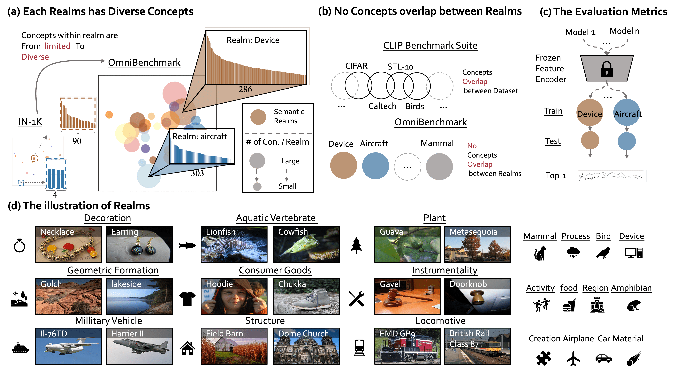

# [ECCV2022] OmniBenchmark



<div align="center">

<div>
    <a href='https://zhangyuanhan-ai.github.io/' target='_blank'>Yuanhan Zhang</a><sup>1</sup>&emsp;
    <a href='https://scholar.google.com.hk/citations?user=ngPR1dIAAAAJ&hl=zh-CN' target='_blank'>Zhenfei Yin</a><sup>2</sup>&emsp;
    <a href='https://amandajshao.github.io/' target='_blank'>Jing Shao</a><sup>2</sup>&emsp;
    <a href='https://liuziwei7.github.io/' target='_blank'>Ziwe Liu</a><sup>1</sup>
</div>
<div>
    <sup>1</sup>S-Lab, Nanyang Technological University&emsp;
    <sup>2</sup>SenseTime Research&emsp;
</div>

---

<div>
    <a href='https://arxiv.org/abs/2207.07106' target='_blank'>[Paper]</a> 
    •
    <a href='https://zhangyuanhan-ai.github.io/OmniBenchmark' target='_blank'>[Project Page]</a>
    •
    <a href='https://paperswithcode.com/sota/image-classification-on-omnibenchmark' target='_blank'>[Leaderboard]</a>
    <br>
    <a href='https://codalab.lisn.upsaclay.fr/competitions/6043' target='_blank'>[Challenge:ImageNet1k-Pretrain Track]</a>
    •
    <a href='https://codalab.lisn.upsaclay.fr/competitions/6045' target='_blank'>[Challenge:Open-Pretrain Track]</a>
</div>
</div>

## Updates
[12/2022] For users in mainland China, you can also download OmniBenchmark v2 at [[HERE](https://opendatalab.org.cn/OmniBenchmark)]. Thanks for the [OpenDataLab](https://opendatalab.com/).

[11/2022] We upload the tar file of the OmiBenchmark V2 at [[HERE](https://entuedu-my.sharepoint.com/:f:/g/personal/yuanhan002_e_ntu_edu_sg/El2wmbzutJBOlu8Tz9HyDJABMmFtsG_8mq7uGh4Q7F1QSQ?e=7V5OMR)]. [md5sum](https://github.com/ZhangYuanhan-AI/OmniBenchmark/issues/5)

[08/2022] We release OmniBenchmark V2 [[Statistics](https://entuedu-my.sharepoint.com/:x:/g/personal/yuanhan002_e_ntu_edu_sg/EQs1hw3MYC1BiF6F1ERQ0koBegQHg54Mv2tV08p_KAdQgw?e=NusVKC)].

[07/2022] OmniBenchmark Challenge ECCV@2022 will start together with [ECCV 2022 SenseHuman Workshop](https://sense-human.github.io/).

[07/2022] Dataset with hidden test has been released.

[07/2022] Code for ReCo has been released.

[07/2022] [arXiv](https://arxiv.org/abs/2207.07106) paper has been released.


## About OmniBenchmark
### OmniBenchamrk V2 
#### Clean Strategy
We use [Bamboo_ViT-B16](https://huggingface.co/spaces/CVPR/Bamboo_ViT-B16_demo) to clean up the OmniBenchmark following two solutions, producing the OmniBenchmark V2 (``meta_url_4_challenge_v2``). 
- Delete images whose inference result lies outside its belonging realm. e.g. delete the image from the "bird" realm if its inference class is "tiger."
- Clustering images by K-means and deleting clusters whose images are less than 2. Images from the such cluster are mostly noise.

#### Trainid and its name
The trainid of OmniBenchamrk V2 is different from V1, we release the mapping file ``trainid2name_v2.json``

#### Evaluation Protocol
- You should train on train.txt, hyper-parameter search on val.txt and finally evaluate on test.txt.
- The V2 results of recent methods will be released soon.


### Download data and annotations

**IMPORTANT:** 
- You can download the data and annotation of OmniBenchamrk V2 at [[HERE](https://entuedu-my.sharepoint.com/:f:/g/personal/yuanhan002_e_ntu_edu_sg/El2wmbzutJBOlu8Tz9HyDJABMmFtsG_8mq7uGh4Q7F1QSQ?e=NyroDS)]. Afer you have downloaded 9 ``omnibenchmark_v2_onedrive.tar.*`` files, you can untar them using 

```
cat omnibenchmark_v2_onedrive.tar.gz.* | tar -xvf
```

For the downloading of OmniBenchamrk V1, you should follow the following step.

```
cd download_tool
#it may cost 2 hours
pythoon download_image.py
```
After downlaoding you should see the following folder structure, i.e., a separate folder of images per realm: 

```
<meta>
...
|--- activity
|   |--- activity.train
|   |   |---images/ #data
|   |   |    |---*.jpg
|   |   |---record.txt #annotation
|   |--- activity.val
|   |   |images/ #data
|   |   |    |---*.jpg
|   |   |--- record.txt #annotation
|   |--- activity.test
|   |   |images/ #data
|   |   |    |---*.jpg
|   |   |--- record.txt #image_path + pseudo_class
...
```
Please refer to ``download_tool/README.txt`` for the detail information of your downloaded files.

### Find the class name 
In downloaded meta files (e.g. car.val), each line of the file is a data record, including the local image path and the corresponding label, separated by a space.
```
#path trainid
XXXXXX 0
XXXXXX 1
XXXXXX 2
...
``` 
You can find the name of ``trainid`` through ``trainid2name.json`` (``trainid2name_v2.json``). 


## Evaluating a model on the OmniBenchmark

### Step1: Model preparation
#### Public models
Inspired by [ImageNet-CoG](https://europe.naverlabs.com/research/computer-vision/cog-benchmark/), we use ResNet50 as a reference model, and evaluate 22 models that are divided into three groups. You can download these models at [HERE](https://drive.google.com/drive/folders/1zJcWHWK6olLPX44t4yE8WyM2Bq1jenAR?usp=sharing). You can check the reference papers of these model in the paper.

After you download models, you should update their path in their config files in the ``linear_probe/model_cfg/``.

e.g.
if you download beit_b16 model in the ./weights/beit_base_patch16_224_pt22k_ft22kto1k.pth
- ``vim linear_probe/model_cfg/beit_b16.yaml``
- Change ``/mnt/lustre/zhangyuanhan/architech/beit_base_patch16_224_pt22k_ft22kto1k.pth`` to ``./weights/beit_base_patch16_224_pt22k_ft22kto1k.pth``.

#### Customer models
- Upload your model files in ``linear_probe/models/ABC.config``, ABC is your model name.
- Upload the corresponding config files in ``linear_probe/configs/model_cfg/``.


### Step2: Data preparation
Updating the path of your downloaded data and annotation in ``linear_probe/configs/100p/``.

e.g. add the information of activity dataset.
- ``vim linear_probe/100p/config_activity.yaml``
- Update the ``root`` in line 13/19 and ``meta`` in line 14/20

### Step3: Linear probing
- ``vim linear_probe/multi_run_100p.sh``
- Change ``models=(beit_b16 effenetb4)`` to ``models=(beit_b16 effenetb4 ABC)``. Separating each model name in space. 
- Change ``datasets=(activity aircraft)`` to ``datasets=(activity aircraft DEF GHI)``. DEF and GHI is the dataset name you want to evaluate, refered to ``linear_probe/configs/100p/config_DEF.yaml``.
- ``sh linear_probe/multi_run_100p.sh``

## About relational contrastive (ReCo) learning
### Similarity information in ImageNet1k
``./ReCo/ImageNet1K.visual.3_hump.relation.depth_version.json`` provides the similarity information of classes in ImageNet1k (Equation 4 in the paper).

### ReCo loss
We can use ReCo loss ``./ReCo/losses.py`` in any supervised contrastive learning framework. Here we use [Parametric-Contrastive-Learning](https://github.com/dvlab-research/Parametric-Contrastive-Learning) (PaCo) in our experiments. 
```
#Run ReCo
sh ./sh/train_resnet50_reco_imagenet1k.sh
```

## Citation
If you use this code in your research, please kindly cite this work.
```
@inproceedings{zhang2022benchmarking,
  title={Benchmarking omni-vision representation through the lens of visual realms},
  author={Zhang, Yuanhan and Yin, Zhenfei and Shao, Jing and Liu, Ziwei},
  booktitle={European Conference on Computer Vision},
  pages={594--611},
  year={2022},
  organization={Springer}
}
```

## Acknowledgement

Thanks to Siyu Chen (https://github.com/Siyu-C) for implementing the linear_probe. \
Thanks to Qinghong Sun for coordinating the data collection. \
Part of the ``ReCo`` code is borrowed from [Parametric-Contrastive-Learning](https://github.com/dvlab-research/Parametric-Contrastive-Learning). 

## License
<a rel="license" href="http://creativecommons.org/licenses/by-nc-nd/4.0/"></a><br />This dataset is licensed under a <a rel="license" href="http://creativecommons.org/licenses/by-nc-nd/4.0/">Creative Commons Attribution-NonCommercial-NoDerivatives 4.0 International License</a>.

<div align="center">


</div>


<!-- | activity | aircraft   | amphibian        | aquatic_vertebrate | bird                 | car             | consumer_goods |
|----------|------------|------------------|--------------------|----------------------|-----------------|----------------|
| 83944    | 41992      | 2136             | 2985               | 105073               | 77378           | 11842          |

| creation | decoration | device           | food               | geological_formation | instrumentality | locomotive     |
|----------|------------|------------------|--------------------|----------------------|-----------------|----------------|
| 9205     | 2935       | 15104            | 35606              | 10192                | 6344            | 5188           |

| mammal   | material   | military_vehicle | process            | region               | structure       | vascular_plant |
|----------|------------|------------------|--------------------|----------------------|-----------------|----------------|
| 46340    | 7289       | 7004             | 3581               | 14887                | 22293           | 48676          | -->
